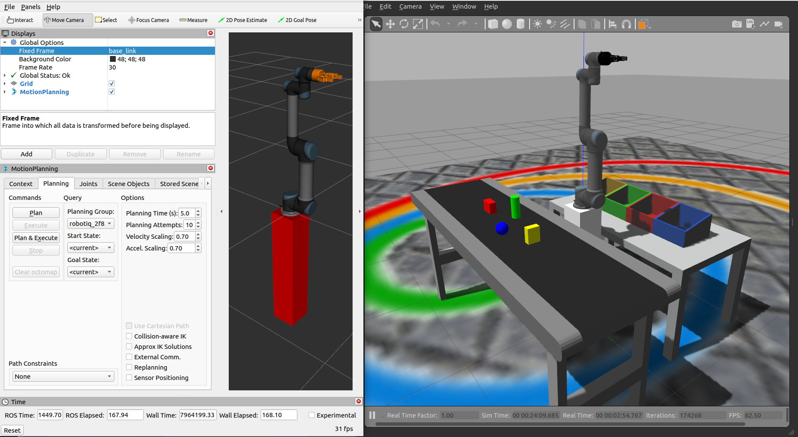
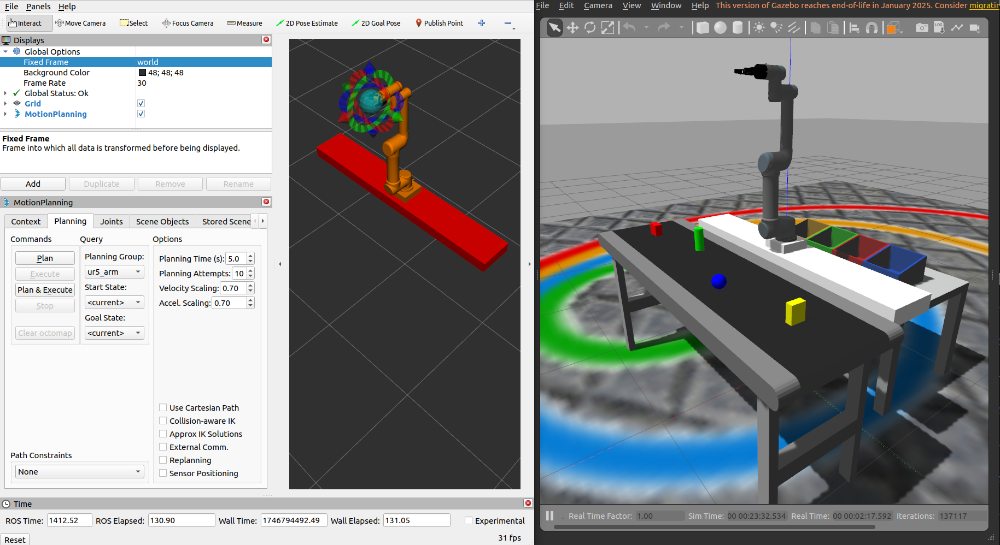

<a href="https://mmg-ai.com/en/"></a>

# JdeRobot Industrial Robotics #

Industrial Robotics is an **open source** collection of resources used in JdeRobot projects and activities related to autonomous robotic manipulation with real and simulated robotic arms and cobots. 

It is based on the excellent work of the IFRA Cranfield Group. Check out their repos at:
- IFRA-Cranfield (2023) ROS 2 Sim-to-Real Robot Control. URL: https://github.com/IFRA-Cranfield/ros2_SimRealRobotControl. 

## Instalation and usage ##

### Installation ###

1. Install Ubuntu 22.04 + ROS2 Humble
2. Install MoveIt2 for ROS2 Humble
    `sudo apt install ros-humble-moveit`
3. Modify the move_group_interface.h script to move_group_interface_improved.h following [these instructions from IFRA Cranfield repos](https://github.com/IFRA-Cranfield/ros2_SimRealRobotControl/tree/humble/include). This allows to execute the Robot/Gripper triggers.
4. Install these packages: 
    ```
    # Rosdep, vcstool and colcon:
    sudo apt install python3-rosdep
    sudo apt install python3-vcstool
    sudo apt install python3-colcon-common-extensions

    # ROS2 Control + ROS2 Controllers:
    sudo apt install ros-humble-ros2-control
    sudo apt install ros-humble-ros2-controllers
    sudo apt install ros-humble-gripper-controllers

    # Gazebo for ROS2 Humble:
    sudo apt install gazebo
    sudo apt install ros-humble-gazebo-ros2-control
    sudo apt install ros-humble-gazebo-ros-pkgs

    # xacro:
    sudo apt install ros-humble-xacro

    # Install CycloneDDS RMW for ROS 2 Humble to fix cycle time issues in humble-moveit:
    sudo apt install ros-humble-rmw-cyclonedds-cpp 
    # Add the following statement into .bashrc file: 
    export RMW_IMPLEMENTATION=rmw_cyclonedds_cpp
    ``` 
4. Create a workspace named ~/dev_ws (this name is compulsory)
5. Add a src folder and clone inside the main branch (humble-devel) of our repo `git clone https://github.com/JdeRobot/IndustrialRobots.git`
6. Compile it twice with `colcon build`
7. Source the new workspace with `source ~/dev_ws/install/local_setup.bash`


### Usage 1: Pick and place example ###

- Platform: ROS2 Humble with MoveIt2 (PILZ Planner)
- Robotic industrial arm: Universal Robot UR5 cobot
- End effector: Robotiq 85 2-finger articulated gripper
- Simulator: Gazebo Classic

Launch the pick and place example with:

- `ros2 launch ros2srrc_launch moveit2_robot.launch.py package:=ros2srrc_ur5 config:=ur5_4`



### Usage 2: Pick and place with additional linear axis example ###

- Platform: ROS2 Humble with MoveIt2 (PILZ Planner)
- Robotic industrial arm: Universal Robot UR5 cobot on top of a simulated 2-meter linear axis. This extra axis is controlled from MoveIt2. 
- End effector: Robotiq 85 2-finger articulated gripper
- Simulator: Gazebo Classic

Launch the UR5 with 2-meter linear axis example with:

- `ros2 launch ros2srrc_launch moveit2_yamaha_all.launch.py package:=ros2srrc_ur5 config:=ur5_5`




