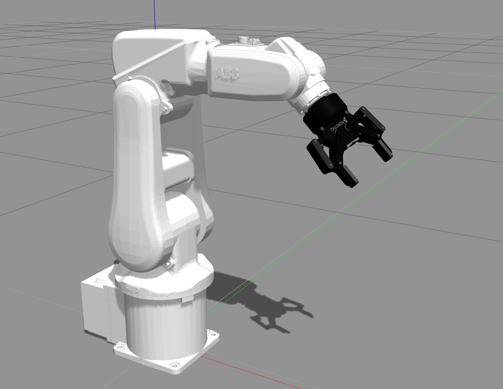
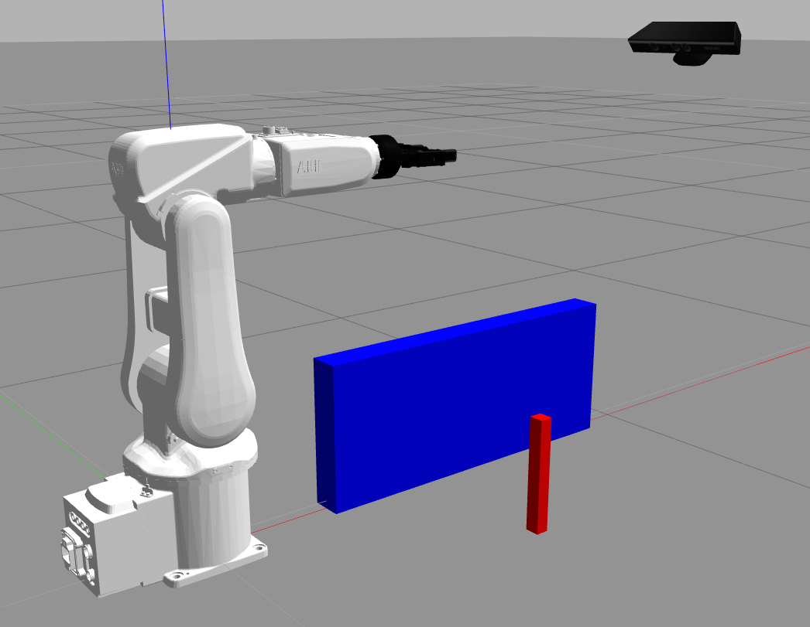

# irb120_robotiq85 #

This repo contains a Gazebo simulation for ROS Kinetic of the ABB IRB120 6-axis industrial robot with a Robotiq 85 2-finger gripper, as seen in the picture:

| ABB IRB 120 with Robotiq 85 gripper | ABB IRB 120 with gripper + Kinect camera |
| ----------------------------------- | ---------------------------------------- |
|  |  |

#### Inverse Kinematics video example ####

[](https://youtu.be/VPPY1_zFruo)


## Dependencies and installation ##

### ABB IRB 120 industrial robot ###

The ABB IRB120 Gazebo simulation is taken from the ROS-Industrial [ABB experimental metapackage](http://wiki.ros.org/abb_experimental). Clone it to your catkin_ws using the kinetic-devel branch:

```
cd catkin_ws/src
git clone https://github.com/ros-industrial/abb_experimental.git
```

The previous ABB experimental metapackage may depend of the main ROS-Industrial [ABB stack](http://wiki.ros.org/abb). Please clone its kinetic-devel branch:

```
git clone https://github.com/ros-industrial/abb.git
```

### Robotiq 85 gripper ###

The Gazebo simulation for the Robotiq85 gripper is taken from the repo provided by Stanley Innovation. Clone it to your catkin_ws and build it: 

```
git clone https://github.com/StanleyInnovation/robotiq_85_gripper.git
```

### Install this package ###

Once you have installed the previous packages, clone this one, build your catkin_ws and source the setup.bash: 

```
git clone https://github.com/diegomrt/irb120_robotiq85.git
cd ..
source devel/setup.bash
```

## Usage ##

### Gazebo simulation of the IRB120-Robotiq85 + Moveit config + Rviz plugin ###

Launch the basic Gazebo simulation, including State and Command ROS controllers:
```
roslaunch irb120_robotiq85_gazebo irb120_robotiq85_gazebo.launch 
```
Launch the basic Gazebo simulation + MoveIt Commander:
```
roslaunch irb120_robotiq85_gazebo irb120_robotiq85_gazebo_moveit.launch
```
Launch the basic Gazebo simulation + MoveIt Commander + RViz including MoveIt plugin:
```
roslaunch irb120_robotiq85_gazebo irb120_robotiq85_gazebo_moveit_rviz.launch
```

### Gazebo simulation of the IRB120-Robotiq85 with a Kinect camera

Launch the basic Gazebo simulation including a Kinect camera
```
roslaunch irb120_robotiq85_gazebo irb120_robotiq85_kinect_gazebo.launch
```
Launch the basic Gazebo simulation including a Kinect camera and some basic objects in the scene:
```
roslaunch irb120_robotiq85_gazebo irb120_robotiq85_kinect_gazebo_world.launch
```

### Basic Python programs to interface moveit_commander API

First, launch the basic Gazebo simulation + MoveIt Commander. Then, there are three options: 

1. Forward kinematics plan and execution:
```
rosrun irb120_robotiq85_gazebo forward_kinematics.py
```
<video src="media/irb120_robotiq85_basicFK.mp4" width="640" height="480" controls preload></video>

2. Inverse kinematics plan and execution (move joints):
```
rosrun irb120_robotiq85_gazebo IK_destination pose.py
```
<video src="media/irb120_robotiq85_basicIK.mp4" width="640" height="480" controls preload></video>

3. Cartesian path (IK) plan and execution (move linear):
```
rosrun irb120_robotiq85_gazebo IK_cartesian_path.py
```

## TO DO List as February 26, 2020

* Update .py files
* Complete a pick and place example in Gazebo
* Configure perception in MoveIt using the Kinect static depth camera
